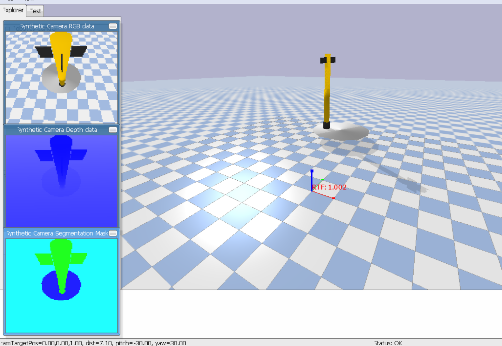

# Rocket Landing Environment with TQC

This repository showcases the use of the `pyflyt` module's rocket landing environment and various reinforcement learning (RL) algorithms to solve it. The TQC (Truncated Quantile Critics) algorithm from Stable Baselines has shown the best performance.

## Table of Contents

- [Introduction](#introduction)
- [Installation](#installation)
- [Usage](#usage)
- [Simulation & Inference with Trained Model](#inference-with-trained-model)
- [Screenshots](#screenshots)
- [Video Demonstration](#video-demonstration)
- [References](#references)

## Introduction

This project demonstrates the application of RL algorithms in the rocket landing environment provided by `pyflyt`. The environment is a challenging testbed for algorithms to learn and perfect the landing of a rocket.

## Installation

### Prerequisites

- Python 3.8+
- Poetry

### Setting Up the Environment

1. **Clone the repository**

    ```bash
    git clone https://github.com/artemi8/RL-Rocket-Landing.git
    cd RL-Rocket-Landing
    ```

2. **Install Poetry**

    Follow the instructions from the [official Poetry documentation](https://python-poetry.org/docs/#installation).

3. **Install dependencies**

    ```bash
    poetry install
    ```

## Usage

To use the environment and run your experiments, follow the steps below.

### Simulation and Inference with Trained Model

To test the best performing TQC model, follow the instructions provided in the Jupyter notebook located at `sample_runs/rocket_landing_experiments-testing.ipynb`.

1. **Launch Jupyter Notebook**

    ```bash
    poetry shell
    ```
    ```bash
    jupyter notebook
    ```

2. **Open and run the notebook**

    Navigate to `sample_runs/rocket_landing_experiments-testing.ipynb` in the Jupyter interface and follow the instructions to run the inference with the trained TQC model.

## Screenshots

### Landed Rocket using TQC algorithm



## Video Demonstration

Watch the rocket landing demonstration: 

https://github.com/artemi8/RL-Rocket-Landing/assets/41601863/fbec0d1a-fc02-46e2-9057-6abdae52bf72


## References

- [PyFlyt Documentation](https://pyflyt.readthedocs.io/)
- [Stable Baselines3 Documentation](https://stable-baselines3.readthedocs.io/)
- [Poetry Documentation](https://python-poetry.org/docs/)
